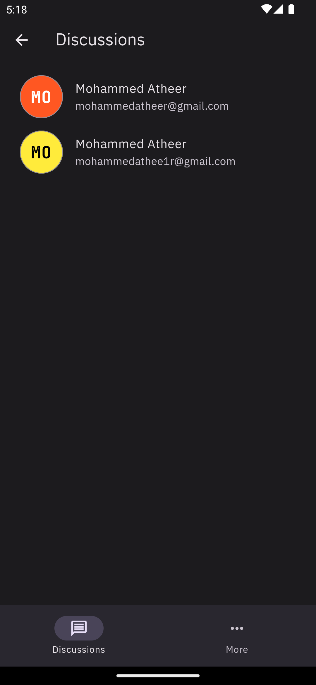

# Messenger App

In some places in the application, I put “TODO”. I did not complete the entire feature. I only added it because it was not explained sufficiently.

# Download
[Download app-release.apk](app-release.apk)

# Supported Messages Types
- Image
- Text
- Gif
- Stickers
- Fallback
- Adaptive to add new image type 

# Feature
- Multi theming based on material 3
- Generate avatar based on gmail or any other id (image is not supported yet + it's easy to be implemented)
- Settings including, theme mode, language, and
- Send first sticker same as telegram
- Stickers builder (debug mode only)
- Image Scaling
- "Simple pagination"

# screenshots
___
|                                |                                                                          |
| :----------------------------: | :----------------------------------------------------------------------: |
|             users              |                             | Ø |
|          Add sticker           |          <image src="images/app/add-sticker.png" height="300">           |
|          Add sticker2          |          <image src="images/app/add-sticker2.png" height="300">          |
| Discussion starter no stickers | <image src="images/app/discussion-starter-no-stickers.png" height="300"> |
|       Discussion starter       |       <image src="images/app/discussion-starter.png" height="300">       |
|      Discussion starter2       |      <image src="images/app/discussion-starter2.png" height="300">       |
|          Light theme           |          <image src="images/app/light-theme.png" height="300">           |
|             Login              |             <image src="images/app/login.png" height="300">              |
|          Select image          |          <image src="images/app/select-image.png" height="300">          |
|           Send image           |           <image src="images/app/send-image.png" height="300">           |
|         Sign up failed         |         <image src="images/app/sign-up-failed.png" height="300">         |
|      Sign up light theme       |      <image src="images/app/sign-up-light-theme.png" height="300">       |
|            Sign up             |            <image src="images/app/sign-up.png" height="300">             |
|          Sticker alt           |          <image src="images/app/sticker-alt.png" height="300">           |
|        Sticker message         |        <image src="images/app/sticker-message.png" height="300">         |
|       Stickers dashboard       |       <image src="images/app/stickers-dashboard.png" height="300">       |
|             Theme              |             <image src="images/app/theme.png" height="300">              |
|             Users              |             <image src="images/app/users.png" height="300">              |
